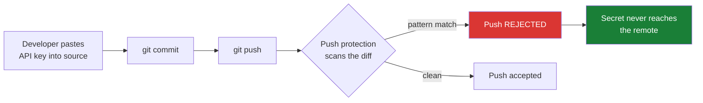

# HotPot Express — push protection demo

A deliberately small, believable service used to demonstrate **GitHub secret scanning push protection**: a credential is caught and the push is **rejected before the secret ever reaches the remote**.

This repository is intentionally **clean**. No secret is committed here, and none ever should be. The secret is introduced *live*, during the demo, and push protection stops it.

## What this demo shows



The point to land: **the block happens at push time, on the developer's machine, before the secret exists anywhere on GitHub.** There is no leak to clean up afterwards, no history to rewrite, no credential to rotate.

## What it is not

This is not a *public monitoring* demo. Public monitoring is the path where a secret **does** land in a public repository, GitHub detects it, and the provider is notified to revoke it. That is a different flow with a different story — see `erinhav/my-cabbages` for that one. Don't mix the two in a single narrative; they have opposite endings.

## The correct pattern, for contrast

`src/config.js` reads the token from the environment, which is what the code should have done all along:

```js
const HF_TOKEN = process.env.HF_API_TOKEN;
```

Copy `.env.example` to `.env` (git-ignored) to run it for real.

## Running the demo

See **[`demo/SCRIPT.md`](demo/SCRIPT.md)** for the presenter run-book, the exact commands, and the screenshot shot-list.

## A note on the demo credential

The demo uses a **synthetic** token generated at run time by `demo/make-demo-secret.sh`. It matches the Hugging Face user-access-token *format* but is random and worthless.

That is not a compromise — it is the correct choice. Push protection matches on **pattern**, not on validity. A synthetic token produces exactly the same block, the same dialog, and the same bypass flow as a live one. Using a real credential would add nothing visible to the demo while creating an actual exposure.
